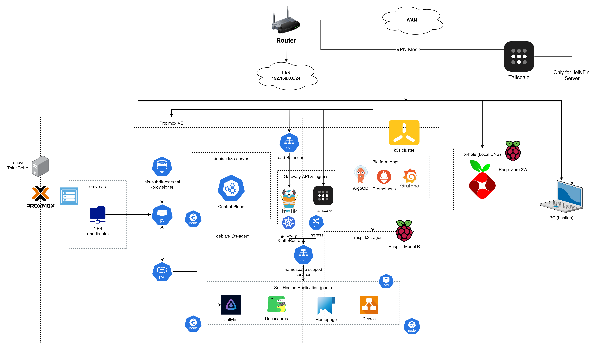
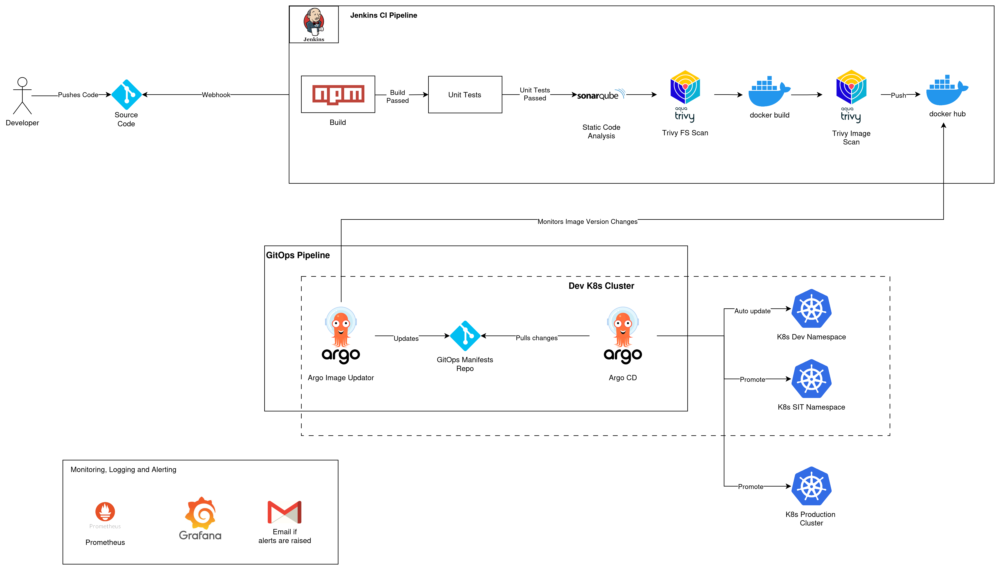

# HomeLab: K3s

## Architecture Diagram



## DevOps Workflow



## Hardware used

1. Lenovo ThinkCentre : i3 (4 Cores), 8Gb RAM, 128 GB SSD (SATA)
2. Raspberry Pi 4 Model B : 2 GB
3. 128GB HP pendrive (Not the most reliable as no RAID setup and USBs are not as reliable as a external SSD/ HDD)
4. TPLink Router (Any router will do as long as the DHCP range is not set to full)

These devices are sufficient for my homelab setup currently.
I will definitely add a more robust storage solution in future with a RAID setup, however, this is okay for my temporary setup for jellyfin server.

One more thing to be added in the future is a local DNS server like PiHole for accessing my Jellyfin server with a private DNS, recognized by all my devices.

Note: I have used the Raspberry Pi as an extra node for now. It will not serve jellyfin pods for now, however, just to add a multi-agent setup, I have used the Raspberry Pi.

## Operating Systems

1. Proxmox on Lenovo ThinkCentre (Hypervisor Type 1)
2. Raspberry Pi OS : Debian Trixie on Raspberry Pi 4
3. OpenMediaVault NAS OS

## VMs deployed and managed

1. OpenMediaVault for NFS file share and acting as a NAS
2. 2 Debian Trixie VMs in Proxmox - One for k3s server and another for k3s agent.
3. Raspberry Pi OS (no VM) on Raspberry Pi 4.

## Specifications of the Proxmox VMs

1. deb-k3s-master - Single k3s server node:
    - 2 vCPUs
    - 2 GB RAM with no ballooning
    - 16 GB disk (SATA 0)
    - Others are set to default.
2. deb-k3s-agent - k3s agent:
    - 2 vCPUs
    - 2 GB RAM with no ballooning
    - 25 GB disk (SATA 0)
    - Others are set to default.
3. omv-nas - OpenMediaVault NAS server:
    - 1 vCPUs
    - 2 GB RAM
    - 8 GB disk (SATA 0)
    - Others are set to default.

### Why Debian Trixie (Debian 13) was chosen over Ubuntu Server?

Debian Trixie is a light weight OS which consumes RAM in the range of 400MB-700MB. This is perfectly suitable for VMs running with 2GB of RAM without balooning and hosting a k3s cluster. On the otherhand, Ubuntu server was found to consume 1-2GB of RAM when k3s was installed both as master and agent nodes, and thus a lighter OS like Debian Trixie was preferred.

## Setup OpenMediaVault NAS Server

To setup OpenMediaVault (OMV) NAS server, assign the USB as a SATA passthrough in proxmox and to use the USB as a NFS file share for storing movies and other media, first we need to spin up a VM in proxmox with the specifications mentioned above.
I have downloaded the ISO file for the OMV OS prior to spinning up the VM from [OpenMediaVault ISO Download](https://www.openmediavault.org/download.html).

Follow these steps to do a device passthrough of the storage media you want to use as a NFS file share:
1. Go to proxmox VM (usually named pve) and go to Disks.
2. Select and wipe the USB drive or any other external storage device and not the main installation media. Usually the main installation media of Proxmox is assigned to the device **sda** with it's partitions. Also be careful and take backup of the storage data already present in USB.
3. Go to the proxmox pve console:
- Run ```bash lsblk ``` to check the disks and partitions. You should see all the devices including your external disk as devices named sda, sdb, ... with their respective partitions. You'll also see the external device currently doesnt have any partitions.
- Run ```bash cfdisk /dev/<device letter>``` to create a partition.
- Select gpt
- Firstly create a **New** partition. You will see a partUUID generated.
- Then select **Write** to write the partition out.
- Select **Quit**.
- Copy the Device partuuid of the external drive by running ```bash blkid``` command.

4. Passthrough the newly partitioned external device using the following:

```bash
qm set < VM ID of omv nas server > -sata1 /dev/disk/by-partuuid/< partuuid copied for the device >
```

Note: Since the default storage of the OMV nas is sata 0, we have assigned the external storage to sata 1. If you are using multiple devices, use sata2, sata3,...satan in the command along with their respective partUUIDs.

Follow these steps to setup and access OMV:
1. Install OMV in the VM in proxmox, mostly with the default settings available.
2. Assign static IP either in the VM or through DCHP reservation in your router. I have used DHCP reservation for assigning a static IP handed out by my DHCP server in the router.
3. Login to OMV using http://< OMV IP > in browser and with initial credentials as:

```
Username: admin
Password: openmediavault

```

Follow these steps to setup NFS file share:

1. Go to Storage -> Disks and then check whether your external storage is being picked up by OMV.
2. Next we need to create a File System: 
- Go to File Systems and select plus icon.
- Select on the preferred file system. For this, I have chosen EXT4 and then select the storage that you want to use as NFS.
- Wait for completion as it will take time based on the size of the disk.
3. Create a Shared Folder next: 
- Go to Shared Folders and then click on plus icon.
- Provide a name and a replative path. 
- Select the file system formatted storage created above.
4. Create a NFS file share:
- First go to Services -> NFS -> Settings and select on Enable.
- Go to Shares under NFS. Click on plus icon and then select the shared folder created above.
- Provide Client CIDR range - Usually it should be your DHCP CIDR range (e.g. 192.168.0.0/24) so that all devices in your nextwork can access this NFS share. You can also specifically set a CIDR range for one device like 192.168.0.203/24.
- Make sure the permission is selected as Read/Write
- Paste these Extra Options keeping kubernetes compatibility in mind - insecure,rw,sync,no_subtree_check,no_root_squash
- Type in a Tag if required.
- Create the NFS file share.


## Setup Debian trixie VMs

To setup deb-k3s-master and deb-k3s-agent, I have used the following commands for easy access and management:

1. Install sudo

```bash
su -
apt update && apt install sudo
usermod -aG sudo < username >
```
Then exit.

2. Set static IP at /etc/network/interfaces

```bash
sudo nano /etc/network/interfaces
```

3. Then Restart networking:
```bash
sudo systemctl restart networking
```

4. After setting static IP at /etc/network/interfaces, run -> echo "nameserver 8.8.8.8" | sudo tee /etc/resolv.conf

### Setup VMs to access NFS:

You will need to install a package called ```nfs-common``` in nodes you want to access the NFS file share for. In this case, the Jellyfin server will be installed on the deb-k3s-agent node (without a failover setup and a single replica).

To install and test whether the NFS file share can be mounted on the VMs:

1. Install nfs-common package:
``` bash
sudo apt update
sudo apt install nfs-common
```
2. Create a mount point: 
```bash 
sudo mkdir -p /mnt/shared_files
```
3. Mount it manually to test:
```bash
sudo mount < NFS-SERVER-IP >:/export/media-nfs /mnt/test-nfs
```
Here **media-nfs** needs to be changed to the relative path you have set while creating Shared Folder in OMV.

### Setup UID and GID for the shared folder:

Kubernetes will not be able to perform R/W operations on the /export/< NFS Shared Folder > in the OMV machine because of how the UID and GID are setup on the folder by default. The easiest way for kubernetes to access the folder is to use a common uid and gid for both the jellyfin pods as well as the shared folder.

1. SSH into the OMV node:

```bash
ssh root@< OMV-Node-ID >
```

2. Run

```bash
sudo chown -R 1000:1000 /export/< relative shared folder path >
```

The UID and GID of 1000 will later be passed down to the jellyfin helm values file so that the pod uses a security context with the same UID:GID pair.

## Setup K3s Kubernetes Cluster:

Setting up a production-ready kubernetes cluster with k3s is a fairly easy process with minimal setup efforts.

Since k3s is a light-weight kubernetes cluster, it is chosen for this setup with 2GB of RAM on each nodes. 

The reference architecture of the k3s Kubernetes cluster can be found here: [Architecture](https://docs.k3s.io/architecture).

By default, k3s clusters are deployed with an Ingress Controller called Traefik and a Load Balancer with svc-lb as the IP provider of the Load Balancer. This makes K3s super useful in quick setup.
Thus K3s has the following dependencies already pre-shipped with it:
- containerd / cri-dockerd container runtime (CRI)
- Flannel Container Network Interface (CNI)
- CoreDNS Cluster DNS
- Traefik Ingress controller
- ServiceLB Load-Balancer controller
- Kube-router Network Policy controller
- Local-path-provisioner Persistent Volume controller
- Spegel distributed container image registry mirror
- Host utilities (iptables, socat, etc)

1. For installing k3s, if the debian machine will be used for k3s server (deb-k3s-master) node (disable traefik), run:

```bash
curl -sfL https://get.k3s.io | sh -s - server --cluster-cidr=10.244.0.0/16 --service-cidr=10.96.0.0/16 --write-kubeconfig-mode 644 --disable traefik
```

2. Fetch master token:

```bash
sudo cat /var/lib/rancher/k3s/server/node-token
```

3. For installing k3s agent on debian agent (deb-k3s-agent) node (as well as for raspberry pi):

```bash
curl -sfL https://get.k3s.io | K3S_URL=https://K3S_SERVER_IP:6443 K3S_TOKEN=< server-node-token > sh -s -
```

Kubectl:

cat /etc/rancher/k3s/k3s.yaml


### Pre-requisites for Raspberry Pi:


If you are joining a Raspberry Pi either as a k3s server or a k3s agent, the following needs to be performed:

Standard Raspberry Pi OS installations do not start with cgroups enabled. K3S needs cgroups to start the systemd service. cgroupscan be enabled by appending cgroup_memory=1 cgroup_enable=memory to /boot/firmware/cmdline.txt.
Note: On Debian 11 and older Pi OS releases the cmdline.txt is located at /boot/cmdline.txt.

Example cmdline.txt:

```bash
console=serial0,115200 console=tty1 root=PARTUUID=58b06195-02 rootfstype=ext4 elevator=deadline fsck.repair=yes rootwait cgroup_memory=1 cgroup_enable=memory
```

Just append ```cgroup_memory=1 cgroup_enable=memory``` in the /boot/firmware/cmdline.txt file and you will be good to go.

## JellyFin server deployment:

Jellyfin is an open-source media server like plex which allows you to maintain a modern "Netflix-like" streaming site of your own.

Here, jellyfin is chosen over plex as jellyfin is better suited for kubernetes deployment, thanks to it's community helm chart.

For installing jellyfin, we first need to install helm. We can do this from our bastion host (laptop or desktop you are using to access proxmox and other stuff) or you can ssh into the k3s master node to install and manage helm packages.


# Create developer authentication and authorization:

1. Developer creates a SSL key and then creates a CSR using openssl command:

```bash
openssl genrsa -out dev1.key 2048
openssl req -new -key dev1.key -out dev1.csr -subj "/CN=dev1/O=dev-team"
```

2. Create a CSR object in kubernetes after developer has sent the CSR to the admin:

```bash
cat dev1.csr | base64 | tr -d "\n"
```

The above command provides the CSR in base64.

Copy and paste it in spec.request in a CSR k8s definition and run kubectl apply to apply the CSR.
The CSR should be in pending state. Admin approves the CSR by running:
```bash
kubectl certificates approve dev1-csr
```

3. Extract the signed cert by kube-apiserver-client and send the .crt file to the developer:
```bash
kubectl get csr dev1-csr -o jsonpath='{.status.certificate}' | base64 -d > dev1.crt
```
4. After the dev1.crt is sent to dev1 user, dev1 should now have dev1.key and dev1.crt.
Create context in kubectl and add these creds:

```bash
kubectl config set-credentials dev1 --client-certificate=dev1.crt --client-key=dev1.key
```

Get cluster name and create a context in kubectl:
```bash
kubectl config get-clusters

kubectl config set-context dev1-context --cluster=default --user=dev1 --namespace=apps-dev
```
5. Dev1 start using the context:

```bash
kubectl config get-contexts

kubectl config set-context dev1-context
```

6. By default, everything will be unauthorized for the dev1 user as no Role or Rolebinding is created. See role-developer.yaml to know how a Role and a Rolebinding is created for the specific user or group.Apply the role-developer.yaml as an admin and now dev1 can start using the resources withing apps-dev or the namespace it was assigned to.

```bash
# As admin
kubectl apply -f role-developer.yaml
```


### Install Helm

To install helm:
1. Run the following commands:
```bash
curl -fsSL -o get_helm.sh https://raw.githubusercontent.com/helm/helm/main/scripts/get-helm-3
chmod 700 get_helm.sh
./get_helm.sh
```

2. Verify installation:
```bash
helm version
```


## Prometheus and Grafana Stack

Install the kube-prometheus-stack for monitoring and observability:

```bash
helm repo add prometheus-community https://prometheus-community.github.io/helm-charts
helm repo update
helm install monitoring \
  --namespace monitoring \
  --create-namespace \
  prometheus-community/kube-prometheus-stack \
  -f prometheus-grafana-values.yaml
```

To uninstall:

```bash
helm uninstall monitoring -n monitoring
```

Retrieve the Grafana admin password:

```bash
kubectl get secret --namespace monitoring \
  -l app.kubernetes.io/component=admin-secret \
  -o jsonpath="{.items[0].data.admin-password}" | base64 --decode ; echo
```

## Certificate Manager and Cloudflare DNS

Create a secret for Cloudflare API authentication:

```bash
kubectl create secret generic cloudflare-api-token-secret \
  --from-literal=api-token=YOUR_API_TOKEN \
  -n cert-manager
```

Replace `YOUR_API_TOKEN` with your actual Cloudflare API token.

## NFS External Provisioner

Install the NFS subdir external provisioner for dynamic PVC provisioning:

```bash
helm install nfs-subdir-external-provisioner \
  nfs-subdir-external-provisioner/nfs-subdir-external-provisioner \
  --set nfs.server=<NFS_SERVER_IP> \
  --set nfs.path=/export/media-nfs-jellyfin
```

Replace `<NFS_SERVER_IP>` with your OpenMediaVault NAS IP address.

## ArgoCD Installation

Install ArgoCD for GitOps-based deployment management:

```bash
helm install argocd argo/argo-cd \
  -n argocd \
  --create-namespace \
  -f values.yaml
```

Retrieve the initial admin password:

```bash
kubectl -n argocd get secret argocd-initial-admin-secret \
  -o jsonpath="{.data.password}" | base64 -d && echo
```

## Traefik Installation

Install Traefik ingress controller:

```bash
helm install traefik traefik/traefik \
  --version $CHART_VERSION \
  --values infrastructure/traefik-values.yaml \
  --namespace traefik \
  --create-namespace
```

## ArgoCD Image Updater

Install ArgoCD Image Updater to automate container image updates:

```bash
kubectl apply -n argocd \
  -f https://raw.githubusercontent.com/argoproj-labs/argocd-image-updater/v0.12.2/manifests/install.yaml
```

Monitor the image updater logs:

```bash
kubectl logs -n argocd -l app.kubernetes.io/name=argocd-image-updater -f
```

You will need to add public key to your gitops repo deploy keys.
Then you need to add the private key as a secret like:

```yaml
apiVersion: v1
kind: Secret
metadata:
  name: github-homelab-repo
  namespace: argocd
  labels:
    # This label is critical for ArgoCD to recognize the secret
    argocd.argoproj.io/secret-type: repository
stringData:
  type: git
  url: git@github.com:repo/name
  # Your private key (the entire block including BEGIN/END lines)
  sshPrivateKey: |
    < INSERT PRIVATE KEY HERE >
```


## ArgoCD multi-cluster:

1. Install argocd CLI
2. Change context first in kubectl to proxmox-k3s (Where argocd is installed)
3. Login to arogcd cluster

```bash
argocd login argocd.siddhomelab.cc \
  --username admin \
  --password '< PASSWORD >' \
  --grpc-web \           
  --insecure
```
4. Add cluster to Argocd: 

argocd cluster add omen-k3s --name omen-k3s

